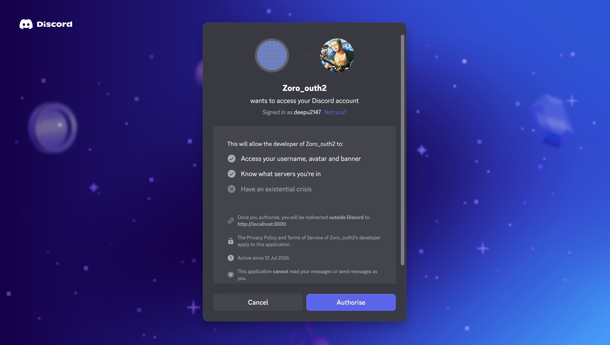
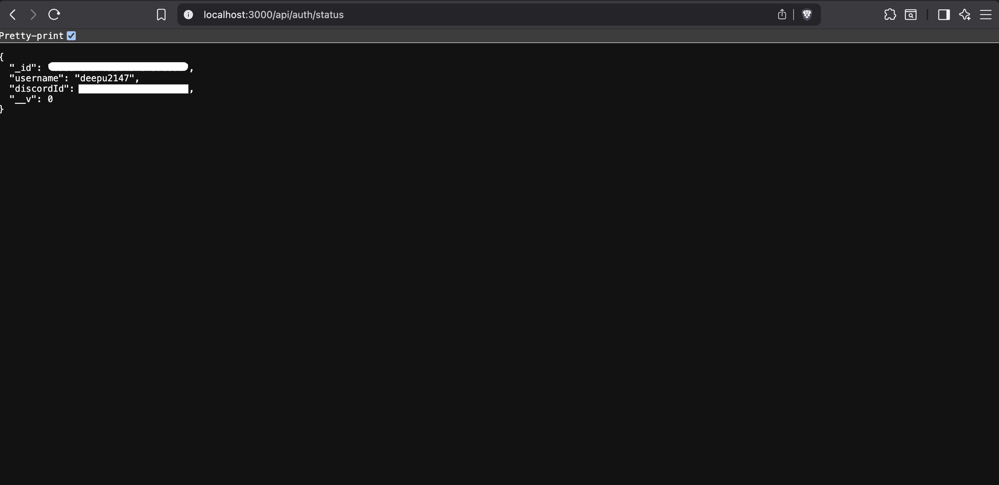
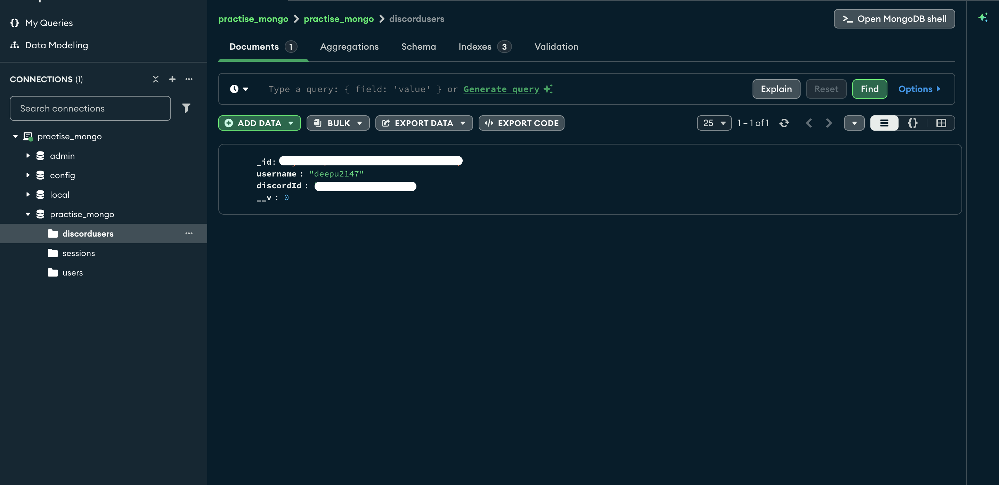

# Express Authentication System

A backend authentication project built with **Express.js**, **Passport.js**, **MongoDB**, and **Express Session**. This project demonstrates session-based authentication using both **Passport Local Strategy** and **Discord OAuth 2.0**, while following a modular Express application architecture.

> **Note:** This project was built while following and extending an Express.js tutorial to gain practical experience with backend development, authentication, sessions, and MongoDB integration.

---

## Features

- RESTful API built with Express.js
- Modular route organization using Express Router
- Local authentication using Passport Local Strategy
- Discord OAuth 2.0 authentication
- Session-based authentication with Express Session
- Persistent session storage using Connect Mongo
- MongoDB integration with Mongoose
- Password hashing before storing user credentials
- Request validation using express-validator
- Cookie parsing with cookie-parser
- Custom middleware implementation
- Environment variable management using dotenv

---
## Screenshots

### Discord OAuth Login

Demonstrates authentication using Discord OAuth 2.0 with Passport.js.



---

### Authentication Status

Displays the authenticated user's information retrieved from the active session.



---

### MongoDB Persistence

Shows the authenticated user stored in the MongoDB database.



---

## Tech Stack

- Node.js
- Express.js
- Passport.js
- Passport Local
- Passport Discord
- MongoDB
- Mongoose
- Express Session
- Connect Mongo
- express-validator
- cookie-parser
- dotenv

---

## Project Structure

```text
src/
├── index.js                    # Application entry point
│
├── mongoose/
│   └── schemas/
│       ├── user.js
│       └── discordUsers.js
│
├── routes/
│   ├── index.js                # Route aggregator
│   ├── users.js
│   └── products.js
│
├── strategies/
│   ├── localStrategy.js
│   └── discordStrategy.js
│
└── utils/
    ├── helpers.js
    ├── middlewares.js
    ├── monsters.js
    └── validationSchema.js
```

---

## Getting Started

### Clone the repository

```bash
git clone https://github.com/<your-username>/express-auth-system.git
cd express-auth-system
```

### Install dependencies

```bash
npm install
```

### Configure environment variables

Create a `.env` file in the project root using the values provided in `.env.example`.

Example:

```env
PORT=3000

MONGO_URI=mongodb://localhost:27017/practise_mongo

SESSION_SECRET=your_session_secret

DISCORD_CLIENT_ID=your_client_id
DISCORD_CLIENT_SECRET=your_client_secret
DISCORD_CALLBACK_URL=http://localhost:3000/api/auth/discord/redirect
```

### Start MongoDB

Ensure your MongoDB server is running locally.

### Run the application

```bash
node src/index.js
```

or

```bash
npm start
```

The server will run on:

```
http://localhost:3000
```

---

## API Endpoints

### Authentication

| Method | Endpoint | Description |
|--------|----------|-------------|
| POST | `/api/auth` | Authenticate using Passport Local Strategy |
| GET | `/api/auth/discord` | Initiate Discord OAuth login |
| GET | `/api/auth/status` | Get authenticated user |
| POST | `/api/auth/logout` | Logout current user |

### Users

| Method | Endpoint |
|--------|----------|
| GET | `/api/users` |
| POST | `/api/users` |
| GET | `/api/users/:id` |
| PUT | `/api/users/:id` |
| PATCH | `/api/users/:id` |
| DELETE | `/api/users/:id` |

### Products

| Method | Endpoint |
|--------|----------|
| GET | `/api/products` |

---

## Concepts Practiced

- Express application architecture
- REST API development
- Express Router
- Middleware
- Passport.js authentication
- Local authentication
- OAuth 2.0 authentication flow
- Session management
- MongoDB with Mongoose
- Password hashing
- Request validation
- Environment variable management
- Cookie handling

---

## Future Improvements

- Use a unified User model for Local and OAuth authentication
- Improve Passport serialization/deserialization
- User registration with email verification
- JWT-based authentication
- Role-based authorization
- Better error handling
- API documentation with Swagger
- Docker support
- Deployment

---

## Acknowledgements

This project was built by following Anson's Express.js tutorial on YouTube as part of my backend learning journey. I used the project to gain hands-on experience with Express.js, Passport.js, MongoDB, session management, request validation, and Discord OAuth authentication.

The implementation reflects my understanding of the concepts covered in the tutorial while serving as a foundation for building more complex backend applications.

---

## Author

**Deepak**